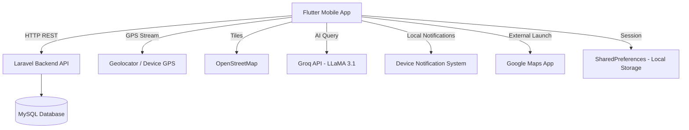

# UniRide — App Explanation for Final Report

## 1. Overview

**UniRide** is a Flutter-based mobile application designed to be a **smart vehicle management companion** for university students and everyday vehicle owners. The app helps users manage their vehicles, track service history, receive maintenance reminders, locate nearby workshops, and troubleshoot common car/motorcycle issues — all from a single app.

- **App Name:** UniRide  
- **Platform:** Android (Flutter cross-platform framework)  
- **Backend:** Laravel REST API (hosted/tunneled remotely)  
- **Backend URL:** `https://<tunnel>.lhr.life/myfyp-backend/public/api`
- **Font / Theming:** Poppins (Google Fonts), dark navy primary color scheme (`#0F172A`, `#1565C0`)

---

## 2. Technology Stack

| Layer | Technology |
|---|---|
| Mobile Frontend | Flutter (Dart) |
| UI Design | Material 3, Google Fonts (Poppins) |
| State Management | `setState` (local widget state) |
| Backend API | Laravel (PHP) REST API |
| HTTP Client | `http` Dart package |
| Local Storage | `shared_preferences` (session/token persistence) |
| Maps | `flutter_map` with OpenStreetMap tiles |
| Location | `geolocator` package |
| Notifications | `flutter_local_notifications` + `timezone` |
| AI Diagnosis | Groq API (LLaMA 3.1 8B model) |
| Image Picking | `image_picker` |
| Calendar | `table_calendar` |

---

## 3. Application Architecture

```
lib/
├── main.dart                  # App entry point, SplashScreen
├── config/
│   └── api_config.dart        # Centralized backend base URL
├── services/
│   ├── session_service.dart   # SharedPreferences-based session/auth management
│   └── notification_service.dart # Local push notification scheduling
├── screens/
│   ├── landing_screen.dart         # Unauthenticated entry / Guest mode
│   ├── login_screen.dart           # Login form
│   ├── register_screen.dart        # Registration form
│   ├── dashboard_screen.dart       # Main homepage (3-tab shell)
│   ├── garage_view.dart            # Vehicle list (Garage tab)
│   ├── vehicle_detail_screen.dart  # Per-vehicle detail + service history
│   ├── add_vehicle_screen.dart     # Add new vehicle form
│   ├── add_service_record_screen.dart  # Log a completed service
│   ├── reminders_screen.dart       # Calendar + upcoming service reminders
│   ├── troubleshoot_screen.dart    # Knowledge base + AI diagnosis
│   ├── workshop_locator_screen.dart # Map + Google Maps deep-link
│   ├── workshop_detail_screen.dart # Workshop info detail
│   ├── settings_screen.dart        # Profile settings, avatar, logout
│   └── guest_home_screen.dart      # Limited guest dashboard
```

---

## 4. User Flow & Navigation

### App Startup
1. **Splash Screen** ([main.dart](file:///c:/Users/ASUS/myfyp_app/lib/main.dart)) — Animated logo + loading dots appear for ~2.2 seconds while the session check runs in parallel.
2. If a saved session is found → navigate to **Dashboard**.
3. If no session → navigate to **Landing Screen**.

### Landing Screen
Presents three options:
- **Login** → `LoginScreen`
- **Register** → `RegisterScreen`
- **Continue as Guest** → [DashboardScreen(isGuest: true)](file:///c:/Users/ASUS/myfyp_app/lib/screens/dashboard_screen.dart#19-26) — limited read-only access

### Dashboard (Main Shell)
The [DashboardScreen](file:///c:/Users/ASUS/myfyp_app/lib/screens/dashboard_screen.dart#19-26) is the app's core. It has a **floating bottom navigation bar** with 3 tabs:

| Tab | Icon | Screen |
|---|---|---|
| Home | 🏠 | Home content with vehicle card, quick actions, map preview |
| Garage | 🚗 | Full vehicle list (GarageView) |
| Schedule | 📅 | Service reminders + calendar (RemindersScreen) |

---

## 5. Feature Descriptions

### 🏠 Home Tab (Dashboard)
- **Greeting** — Time-based greeting (Good Morning / Afternoon / Evening) with the user's name.
- **Vehicle Status Slider** — Swipeable `PageView` showing all user vehicles. Each card shows plate number, brand/model, mileage, and an integrated **GPS Trip Tracker**.
- **GPS Trip Tracker** — Start/Stop button that uses `Geolocator.getPositionStream()` to accumulate real-time driving distance (km). When stopped, the calculated distance is added to the vehicle's mileage and saved to the backend via `PATCH /api/vehicles/{id}`. Auto-stops after 10 minutes of no movement.
- **Quick Actions** — Two compact buttons: **Troubleshoot** and **Add Vehicle**.
- **Map Preview** — A non-interactive `flutter_map` thumbnail showing the user's current GPS location. Tapping it navigates to the Workshop Locator.

---

### 🚗 My Garage Tab
- Displays all vehicles belonging to the logged-in user fetched from `GET /api/users/{id}/vehicles`.
- Each vehicle card shows plate number, brand/model, mileage, and type badge (Car / Motorcycle).
- Tapping a vehicle opens **Vehicle Detail Screen**.
- Long-swipe or edit sheet available for editing/deleting a vehicle.

#### Vehicle Detail Screen
- Shows vehicle info (plate, brand, model, mileage).
- Stat cards: **Service Records count** and **Total Spent (RM)**.
- **Service History** — chronological list of all completed service records (date, mileage at service, cost, notes).
- A FAB button opens **Add Service Record**.
- Tapping any record opens an edit/delete bottom sheet.

#### Add Service Record Screen
- Dropdown to select service type (car-specific or motorcycle-specific list).
- For `Other`, a free-text input appears.
- **Known service types** automatically show a reminder hint (e.g., _"Reminder auto-set: +5000 km or 3 months"_) based on a hardcoded `kServiceThresholds` map.
- Mileage is auto-filled from the vehicle's current mileage.
- Date picker (Material Date Picker) for service date.
- Submits to `POST /api/vehicles/{id}/services`.
- Backend automatically calculates the **next due date and mileage** and creates a pending service reminder.

---

### 📅 Service Schedule Tab (Reminders)
- **Interactive Calendar** (`table_calendar`) showing colored dots on days with scheduled services.
- Selecting a date reveals a panel of services due that day.
- **Upcoming Services List** — cards showing:
  - Service type, plate number, due date
  - Mileage progress bar (current vs target km)
  - Time progress bar (days since last service vs interval)
  - Status badges: `OVERDUE`, `DUE TODAY`, `Xd left`, or just `Xd`
- **Mark as Done** — Tapping "I Already Did This" shows a dialog prompting cost and current mileage → submits `PATCH /api/services/{id}/complete`.
- **Overdue Banner** — Red banner appears if any service is past due.
- **Push Notifications** — Automatically schedules two local notifications per service: one 7 days before and one on the due day at 9:00 AM.
- **Year/Month Picker** — Tapping the title opens a custom month/year grid picker for navigation.

---

### 🔧 Troubleshoot Screen
- Accessed from the Home tab quick action.
- **Knowledge Base Search** — Real-time keyword/text matching against 25 pre-built vehicle issue entries (15 basic, 10 advanced). Results show:
  - Problem description
  - Cause
  - What to do (solution)
  - Danger badge (Low / Medium / High)
  - Red "professional help" banner for advanced issues
- **AI Diagnosis (Groq)** — A purple AI button sends the user's query to the **Groq LLaMA 3.1 8B** model with a car mechanic system prompt. The AI returns a structured JSON response that is rendered in the same card format as knowledge base results, labeled "AI Generated".
- If no knowledge base match is found, the app suggests using the AI button.

---

### 📍 Workshop Locator Screen
- Accessed by tapping the map preview on the home tab.
- Shows an interactive `flutter_map` map centered on the user's current GPS location with a location pin marker.
- **"Find Workshops Near Me"** button launches Google Maps externally, performing a location-aware search for `vehicle+workshop+near+{lat,lng}`.

---

### ⚙️ Settings Screen
- Accessed by tapping the avatar chip on the Dashboard header.
- Shows user profile (name, email, avatar).
- Supports avatar photo change via `image_picker`.
- **Edit name** functionality.
- **Delete account** option.
- **Logout** — clears `SharedPreferences` session and navigates back to the Landing Screen.

---

### 🔐 Authentication
- **Registration** — Matric number, name, email, password fields. Submits to `POST /api/register`.
- **Login** — Matric number + password. Submits to `POST /api/login`. On success, the user's [id](file:///c:/Users/ASUS/myfyp_app/lib/main.dart#15-42), `name`, and `email` are saved to `SharedPreferences` via [SessionService](file:///c:/Users/ASUS/myfyp_app/lib/services/session_service.dart#3-63).
- **Guest Mode** — The [DashboardScreen(isGuest: true)](file:///c:/Users/ASUS/myfyp_app/lib/screens/dashboard_screen.dart#19-26) shows a locked/read-only view. Tapping restricted features shows a **Login Required** bottom sheet.
- **Session Persistence** — `SessionService.isLoggedIn()` checks for a saved user ID in SharedPreferences. No JWT token is used — the user ID is trusted directly on the client.

---

## 6. Backend API Endpoints Used

| Method | Endpoint | Purpose |
|---|---|---|
| `POST` | `/api/register` | Register new user |
| `POST` | `/api/login` | Login |
| `GET` | `/api/users/{id}/vehicles` | Fetch user's vehicles |
| `POST` | `/api/vehicles` | Add new vehicle |
| `PATCH` | `/api/vehicles/{id}` | Update vehicle (mileage, details) |
| `DELETE` | `/api/vehicles/{id}` | Delete vehicle |
| `GET` | `/api/vehicles/{id}/services` | Get service history |
| `POST` | `/api/vehicles/{id}/services` | Add service record |
| `PATCH` | `/api/services/{id}` | Edit service record |
| `PATCH` | `/api/services/{id}/complete` | Mark service done (logs cost + mileage) |
| `DELETE` | `/api/services/{id}` | Delete service record |
| `GET` | `/api/users/{id}/pending-services` | Fetch upcoming/pending service reminders |

---

## 7. Key Technical Features

| Feature | Implementation |
|---|---|
| GPS Trip Tracker | `Geolocator.getPositionStream()` with 10m distance filter; auto-stops on 10 min idle |
| Auto Reminder Scheduling | `kServiceThresholds` map + backend calculates next due date and mileage |
| AI Car Diagnosis | Groq API, `llama-3.1-8b-instant` model, structured JSON output |
| Push Notifications | `flutter_local_notifications` with exact time scheduling (7 days before + due day) |
| Interactive Map | `flutter_map` + OpenStreetMap tiles, no API key required |
| Session Management | `SharedPreferences` (no JWT; user ID stored locally) |
| Offline-Safe UI | All screens handle loading states, timeouts, and connection errors gracefully |
| Guest Mode | Full UI accessible without login; restricted features redirect to login prompt |

---

## 8. System Architecture Diagram



---

## 9. Screens Summary Table

| Screen | Key Purpose |
|---|---|
| [SplashScreen](file:///c:/Users/ASUS/myfyp_app/lib/main.dart#43-49) | Animated logo, auth check, routing |
| [LandingScreen](file:///c:/Users/ASUS/myfyp_app/lib/screens/landing_screen.dart#8-121) | Login / Register / Guest entry |
| `LoginScreen` | Matric no + password auth |
| `RegisterScreen` | New account creation |
| [DashboardScreen](file:///c:/Users/ASUS/myfyp_app/lib/screens/dashboard_screen.dart#19-26) | Main 3-tab shell: Home, Garage, Schedule |
| [GarageView](file:///c:/Users/ASUS/myfyp_app/lib/screens/garage_view.dart#8-263) | Vehicle list with edit/delete |
| [VehicleDetailScreen](file:///c:/Users/ASUS/myfyp_app/lib/screens/vehicle_detail_screen.dart#8-15) | Service history, cost summary, edit vehicle |
| `AddVehicleScreen` | Add new car/motorcycle |
| [AddServiceRecordScreen](file:///c:/Users/ASUS/myfyp_app/lib/screens/add_service_record_screen.dart#47-65) | Log completed service, auto-reminder hint |
| [RemindersScreen](file:///c:/Users/ASUS/myfyp_app/lib/screens/reminders_screen.dart#34-40) | Calendar, upcoming services, mark-as-done |
| [TroubleshootScreen](file:///c:/Users/ASUS/myfyp_app/lib/screens/troubleshoot_screen.dart#6-12) | Knowledge base + AI (Groq) car diagnosis |
| [WorkshopLocatorScreen](file:///c:/Users/ASUS/myfyp_app/lib/screens/workshop_locator_screen.dart#9-15) | Map view + Google Maps deep-link search |
| `SettingsScreen` | Profile, avatar, name edit, logout |
| `GuestHomeScreen` | Read-only limited dashboard for guests |
